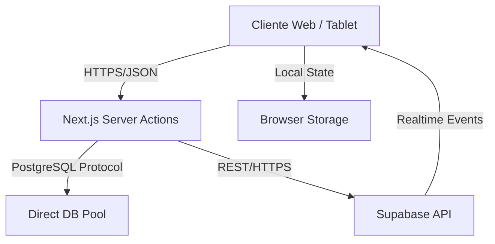

# DOCUMENTO TÉCNICO DE ARQUITECTURA - PARGO ROJO OS (ENTERPRISE EDITION)
**Versión:** 1.0 (Oficial)
**Fecha:** 2026-02-09
**Estado:** VIVO - Documento Maestro de Ingeniería

---

## 1. VISIÓN GENERAL DEL SISTEMA
### 1.1 Alcance
Sistema POS (Point of Sale) y ERP ligero diseñado para operaciones gastronómicas de alto volumen. El sistema no es solo un facturador, sino un orquestador de operaciones que integra salón, cocina, inventario y finanzas en tiempo real.

### 1.2 Principios de Diseño
- **Offline-First (Parcial):** La operación crítica (toma de pedidos) debe resistir micro-cortes de internet, aunque la validación final requiere conexión.
- **Single Source of Truth:** PostgreSQL (Supabase) es la única fuente de verdad. No existen "copias maestras" locales.
- **Fail-Safe Operation:** Si falla el frontend de un mesero, el pedido no debe perderse. Si falla la impresora, el KDS es el respaldo.
- **Auditoría Paranoica:** Cada acción financiera (descuento, anulación, retiro de caja) deja huella inmutable.

### 1.3 Supuestos Operativos
- Conexión a internet estable (fibra/4G) el 99% del tiempo.
- Hardware heterogéneo (Tablets Android, iPads, PCs Windows).
- Rotación alta de personal (UI debe ser intuitiva).

---

## 2. ARQUITECTURA GENERAL

### 2.1 Componentes del Sistema
1.  **Frontend (Cliente):**
    - **Tecnología:** Next.js 16 (React Server Components).
    - **Hosting:** Vercel Edge Network.
    - **Estado Local:** React Context + LocalStorage (para persistencia efímera de carrito).
2.  **Backend (Servidor/API):**
    - **API Layer:** Next.js Server Actions (BFF - Backend for Frontend).
    - **Database Ref:** Supabase Client (PostgREST) + `pg` (Pool directo para operaciones críticas).
    - **Realtime:** Supabase WebSockets (escucha de tabla `orders`).
3.  **Base de Datos:**
    - **Motor:** PostgreSQL 15+.
    - **Lógica:** Pl/pgSQL (Funciones RPC para transacciones complejas).
    - **Seguridad:** RLS (Row Level Security) activo en todas las tablas públicas.

### 2.2 Diagrama de Comunicación

---

## 3. MÓDULOS DEL SISTEMA

### 3.1 AUTENTICACIÓN Y SESIONES
- **Objetivo:** Controlar acceso seguro y persistente según roles.
- **Tecnología:** Supabase Auth (JWT).
- **Roles:** `admin`, `manager`, `cashier`, `waiter`, `cook`, `host`.
- **Validaciones:**
    - Sesión expira a los 7 días (Refresh Token automático).
    - **PIN de Mesero:** Capa adicional para operaciones rápidas en terminales compartidas.
    - **Bloqueo de Concurrencia:** Un cajero no puede tener dos cajas abiertas en dispositivos diferentes.

### 3.2 TURNOS Y CAJA (SHIFT MANAGEMENT)
- **Objetivo:** Control estricto del efectivo y responsabilidad financiera.
- **Flujo Crítico:**
    1.  `start_shift` (Inicio de jornada laboral del empleado).
    2.  `open_cashbox` (Responsabilidad financiera de una caja física).
    3.  `close_cashbox` (Arqueo ciego: el sistema no muestra el esperado hasta ingresar lo real).
    4.  `end_shift` (Cierre de jornada).
- **Reglas Innegociables:**
    - No se puede facturar sin una caja abierta.
    - No se puede cerrar turno con caja abierta.
    - Los retiros de dinero requieren motivo obligatorio.
- **Tablas:** `shifts`, `cashbox_sessions`, `cash_movements`.

### 3.3 VENTAS Y PEDIDOS (CORE)
- **Objetivo:** Captura y procesamiento de transacciones.
- **Flujo:**
    1.  Creación de Orden (`pending`).
    2.  Envío a Cocina (`in_preparation`).
    3.  Entrega (`delivered`).
    4.  Pago (`completed` / `paid`).
- **Validaciones Técnicas:**
    - **Stock:** Validación atómica de inventario al confirmar venta (Trigger `deduct_inventory`).
    - **Integridad:** El total debe coincidir con la suma de `unit_price * quantity`. El backend recalcula, no confía en el frontend.
    - **Kiosco (Bypass RLS):** Uso de conexión directa (`pg`) para evitar bloqueos de permisos en terminales de auto-servicio o meseros con permisos limitados.

### 3.4 INVENTARIO Y RECETAS
- **Objetivo:** Costeo real y control de mermas.
- **Modelo:**
    - `ingredients`: Insumo base (ej: Harina kg).
    - `products`: Item de venta (ej: Pizza).
    - `recipes`: Tabla pivote (Pizza = 0.2kg Harina + 0.1kg Queso).
- **Automatización:** Trigger `deduct_inventory_on_sale` descuenta automáticamente al finalizar la orden.
- **Alertas:** Stock negativo permitido (para no frenar ventas) pero auditado como "Descuadre".

### 3.5 COCINA Y PRODUCCIÓN (KDS)
- **Objetivo:** Eliminar papel y medir tiempos.
- **Pantallas:** `/admin/kitchen`.
- **Lógica:**
    - WebSockets escuchan `INSERT` en `orders`.
    - Sonido de alerta (Howler.js).
    - Tiempos de preparación:
        - < 10min: Verde.
        - 15-20min: Amarillo.
        - > 20min: Rojo (Alerta Manager).

---

## 4. MODELO DE DATOS CRÍTICO

### 4.1 Tablas Principales
- **`orders`**: Cabecera de pedido.
    - `id` (UUID), `status` (ENUM), `total` (NUMERIC), `waiter_id` (FK), `table_id` (FK).
- **`order_items`**: Detalle.
    - `product_id`, `quantity`, `unit_price`, `notes`.
- **`tables`**: Gestión de salón.
    - `status` ('free', 'occupied'), `x_pos`, `y_pos` (Coordenadas visuales).
- **`audit_logs`**: Trazabilidad.
    - `action`, `table_name`, `record_id`, `old_data`, `new_data`, `severity`.

### 4.2 Restricciones (Constraints)
- `orders_total_check`: El total no puede ser negativo.
- `unique_active_shift`: Un usuario solo puede tener un turno activo.
- `fk_restaurant`: Todos los registros deben tener `restaurant_id` (Multi-tenancy).

---

## 5. API Y SEGURIDAD

### 5.1 Endpoints Server Actions
- `createOrderWithNotes`: Transacción ACID para crear cabecera + items.
- `transferOrderBetweenTables`: Función RPC compleja para mover/fusionar cuentas.
- `closeCashbox`: Valida integridad financiera y cierra sesión.

### 5.2 Middleware
- **RLS (Row Level Security):**
    - Un mesero solo puede ver pedidos de SU restaurante.
    - Un cliente solo puede ver SUS pedidos.
    - Admin ve TODO el restaurante.

---

## 6. FLUJO OFFLINE Y SINCRONIZACIÓN
- **Estado Actual:** El sistema requiere conexión para *finalizar* transacciones.
- **Mitigación:**
    - El Frontend retiene el pedido en memoria si falla la red.
    - Botón "Reintentar" aparece en fallos de conexión.
    - El KDS tiene caché local de los últimos pedidos para no quedar en blanco.

---

## 7. SEGURIDAD Y ANTIFRAUDE
- **Escenario:** Mesero anula pedido cobrado para quedarse el efectivo.
    - **Control:** Solo Manager puede anular (`void`).
    - **Registro:** Se guarda registro en `cancelled_orders` con motivo.
- **Escenario:** Cajero abre caja sin registrar venta.
    - **Control:** Evento `drawer_opened` (si hay integración con hardware) o auditoría de impresiones "No Fiscales".

---

## 8. RIESGOS TÉCNICOS Y MITIGACIONES
1.  **Riesgo:** Caída de Supabase.
    - **Mitigación:** Modo "Offline Emergencia" (en desarrollo - guardado local y sync posterior).
2.  **Riesgo:** Lentitud en reportes con mucha data.
    - **Mitigación:** Vistas materializadas (`materialized views`) para dashboards históricos, refrescadas cada hora.
3.  **Riesgo:** Conexiones agotadas (Pool exhaustion).
    - **Mitigación:** Uso de Supabase Transaction Pooler (Puerto 6543) para conexiones efímeras.

---

**Este documento es la fuente de verdad técnica para el desarrollo y mantenimiento del sistema Pargo Rojo OS.**
